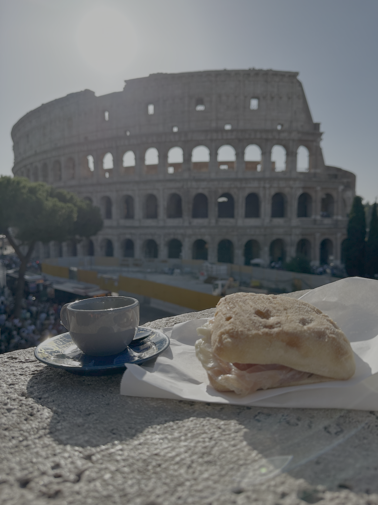

I guess the first two years were destined to have just one despatch. To be honest, I aimed for this one to come out not
long after the first one (I started writing this piece on the 22nd of July, 2023). So, I figured, might as well continue
writing it. 

<!-- more -->
But my moving finger did not write(1), and thus, did not move on. I've left the
original bit of writing as-is, and have made annotations to it in the sidenotes. Please, enjoy.
{.annotate}

1. type, if we're being pedantic. If Omar Khayyam ever comes to know that I'm twisting his poignant couplets to get
   eyeballs on the
   internet, he *will* rise from his grave to have some words with me.

In terms of overall well-being - I'm good. Busy(1) and
good. I've gotten used to this city's rhythms. I did realise fairly early on in my stint that NYC has a pretty solid PR
racket going on. This piece will from
time to time, crib about things that the PR machinery very conveniently keeps out of the news. When I'm sitting in the Q
train and hear the conductor make a sudden announcement saying hello, this is not the Q train anymore, this is actually
the F train, I don't flinch. I stay seated, because muay thai has taught me not to show weakness to
anyone(2), least of all to the first city I've encountered that
has a [non-deterministic](https://dictionary.cambridge.org/us/dictionary/english/non-deterministic){:target="_blank"}
subway system.
{.annotate}

1. I was a sweet summer child when I wrote this in 2023. Having spent every saturday
   of the past year in school, getting a part-time degree, I can say I'm busy *now*
2. muay thai also taught me how to injure
   myself in July 2023-ish, and I haven't kicked a bag since.

When I'm sitting in a bus going somewhere, and a [Kramer-esque fella](https://www.youtube.com/watch?v=w6Chsy5cdkk){:target="_blank"} pitches me a nice scheme and
hands me his business card, I smile and take it, promising to get in touch
with him soon. If I see human excrement on the streets, I walk by, with the best air of nonchalance I can
muster.(1)  
{.annotate}

1. I've seen more human poop on the street here in 7
   months than I did in India in 18 years.

There's also the fact that looking for places to rent here can quickly teach you what the word "absurd" truly means.
Here's one instance - remember [that episode](https://www.youtube.com/watch?v=GX25jrMr3MI){:target="_blank"} in HIMYM,
where Marshall and Lily's apartment turns out to be crooked? Remember how when you first saw the damn ep, you chalked it
down to the writers' table in the show smoking really high quality stuff, writing something over-the-top in the way only
HIMYM writers did? So back in Feb I found an apartment in a great location in the West Village, for really cheap, the
only problem being the small(1) bedrooms. I figured there was a catch -
small bedrooms are, after all, de rigeur in this town. What else was it that kept the price so low? Upon reaching for my
viewing, I entered the apartment, and after a while said out loud (within earshot of the realtor), "Is it just me, or is
the floor tilted?", thinking, why would an apartment with a tilted floor ever be thought fit to exhibit to prospective
tenants? The realtor just shrugged and said, "it's an old building". Oh well. Looked through a bunch of
apartments(2), and managed to find decent digs in the end.
{.annotate}

1. imagine the standard 4 foot by 2 foot trench that infantrymen generally dig at the end of a long, hard day
2. around forty-ish

Sorry, didn't mean to come off as someone who changed cities to provide himself with the spice of
life(1) only to be mad about the spice he encountered. I was, and remain, a spice
enthusiast. I love that there's a world out there for me to explore.  
{.annotate}

1. i.e., variety

Changing cities is the best way to provide yourself with
variety(1). Having changed cities about 10 times in my 26-year life(2), I'd say I'm somewhat of a spice enthusiast by
now. Spice is addictive. It is physically and mentally painful. It numbs your
senses, brings excitement to your life, teaches you about regret, and sometimes it gives you a nice story to tell to
people at dinner. All in all, it's not too bad. I will say though that after eating too much sichuan food over a week in
Singapore, I cannot really deal with regular spice very well. Metaphorical spice though? Bring it *on*. 
{.annotate}

1. an *overrated* spice of life
2. man, I'd started writing this piece when I'd just turned 26, and now I'm roughly 3 months out from 28. Time flies.

I've done a lot since the last despatch. Went to Italy for the first time - did 11 cities in 11 days: Rome, The Vatican,
Palermo, Cefalu, Trapani, Erice, Bari, Matera, Alberobello, Monopoli, Florence. Got into eating clean and lifting
weights(1). Visited Rio and its gorgeous beaches. <!-- Met hellie. --> Tried to learn skiing. Took an elementary
spanish class. Saw my cousin married off in Allahabad. Took a dip at the [sangam](https://en.wikipedia.org/wiki/Triveni_Sangam){:target="_blank"}. Became much better at writing Python. You
know, the works. 
{.annotate}

1. my PR for deadlifts is 85kg. Aim to get to 100 this year.
